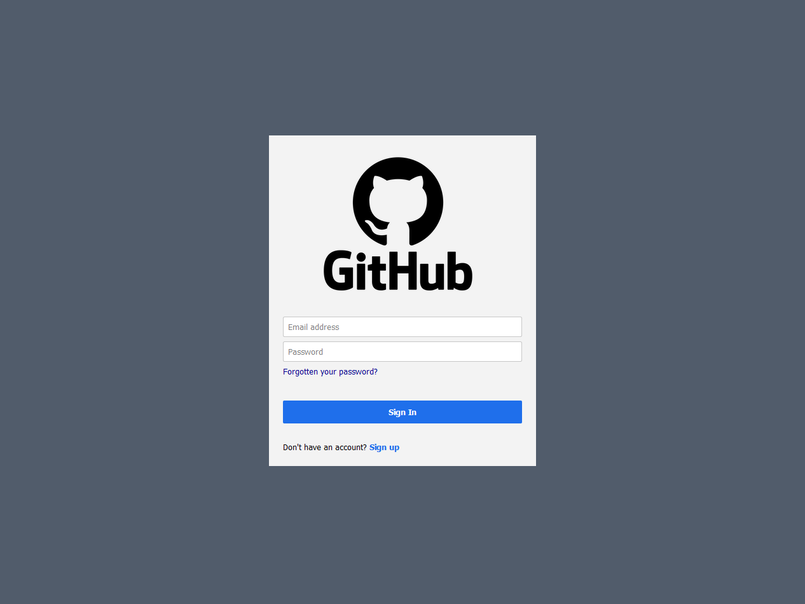

# PyQt5 LoginDialog

Modern login form
* There are sign in, sign up and restore password areas.
* User activity is logged to console and file through logging library.

Tools:
* Python
* logging
* PyQt5
* CSS
* MondoDB

